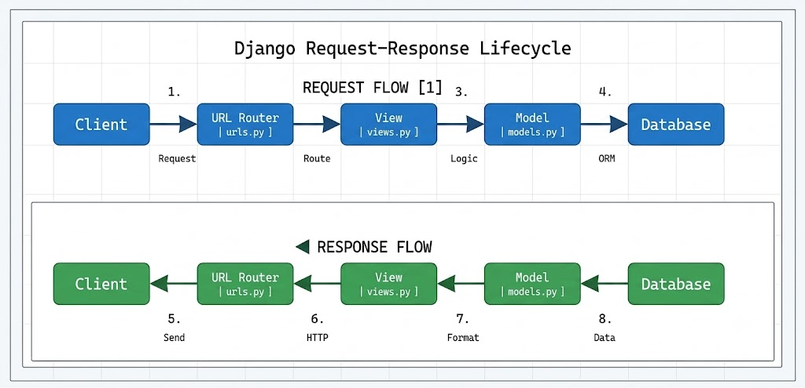

# Django Request Lifecycle

# Example Request:
```
    GET /api/courses/
```

<br>

# Django Request-Response Lifecycle
### 1. Client Sends a Request
The request begins at the client (browser, mobile app, or API client). A request such as `GET /api/courses` is sent to the Django server, where Django starts processing it.

### 2. URL Router Matches the Endpoint
The request first reaches `urls.py`, which acts as the URL router. It matches the requested URL with the appropriate route and forwards the request to the corresponding view function or class.

### 3. View Processes the Business Logic
The view (`views.py`) contains the application's business logic. It validates the request, performs any required computations, and communicates with the model whenever data needs to be retrieved, created, updated, or deleted.

### 4. Model Interacts with the Database and Returns a Response
The model (`models.py`) executes database queries through Django's ORM. After fetching or modifying the data, it returns the result to the view. The view formats the data (typically as JSON for APIs) and sends an HTTP response (e.g., `200 OK`) back to the client.



<br>

# Role of Middleware

Middleware sits **between the client and the URL router** on the request path, and **between the view and the client** on the response path. Every incoming request passes through the middleware before reaching `urls.py`, and every outgoing response passes through the middleware again before being sent back to the client. This allows middleware to inspect, modify, or block requests and responses globally.


## Builtin Middlewares
### 1. AuthenticationMiddleware

**Class:** `django.contrib.auth.middleware.AuthenticationMiddleware`

**Purpose:**
- Associates the logged-in user with every incoming request.
- Makes the authenticated user available through `request.user`.
- Enables authentication and permission checks throughout the application.

### 2. CsrfViewMiddleware

**Class:** `django.middleware.csrf.CsrfViewMiddleware`

**Purpose:**
- Protects the application against **Cross-Site Request Forgery (CSRF)** attacks.
- Verifies that POST, PUT, PATCH, and DELETE requests include a valid CSRF token.
- Rejects malicious requests that do not contain a valid token, helping secure forms and APIs.

<br>

# Difference between WSGI and ASGI

### WSGI (Web Server Gateway Interface)

- WSGI is the traditional Python interface for web applications.
- It processes requests **synchronously**, meaning each request is handled one at a time.
- It is best suited for standard web applications that primarily handle HTTP requests and database operations.
- Django uses **WSGI by default** for most projects because it is simple, stable, and works well for typical CRUD applications.

### ASGI (Asynchronous Server Gateway Interface)

- ASGI is the modern successor to WSGI and supports **asynchronous programming**.
- It can handle multiple requests concurrently using `async` and `await`.
- ASGI supports not only HTTP but also **WebSockets**, long-lived connections, background tasks, and real-time applications.
- It is ideal for applications such as chat systems, live notifications, multiplayer games, and streaming services.

## Which One Does Django Use by Default?

Django uses **WSGI by default** for traditional deployments. Every new Django project includes a `wsgi.py` file for running the application with WSGI-compatible servers such as Gunicorn or uWSGI.

## When Would You Switch to ASGI?

You would switch to **ASGI** when your application requires asynchronous features, such as:

- Real-time chat using WebSockets
- Live notifications
- Streaming responses
- Long-running asynchronous tasks
- High-concurrency applications that benefit from `async` views

Using ASGI allows Django to take advantage of asynchronous programming while remaining fully compatible with standard HTTP requests.

<br>

# MVC Pattern and Django's MVT Architecture

### What is MVC?

**MVC (Model-View-Controller)** is a software design pattern that separates an application into three components, making it easier to develop, maintain, and scale.

- **Model (M):** Manages the application's data and interacts with the database.
- **View (V):** Displays the user interface and presents data to the user.
- **Controller (C):** Handles user input, processes requests, communicates with the model, and selects the appropriate view.

## Mapping MVC to Django's MVT

Django follows the **MVT (Model-View-Template)** pattern, which is very similar to MVC but with different naming.

| MVC Component | Django (MVT) | Description |
|--------------|--------------|-------------|
| **Model** | **Model** (`models.py`) | Represents the database structure and handles all database operations using Django's ORM. |
| **View** | **Template** (`.html` files) | Responsible for presenting data to the user by rendering the user interface. |
| **Controller** | **View** (`views.py`) | Contains the business logic, processes requests, interacts with models, and returns responses or renders templates. |

## How MVT Works in Django

1. The client sends a request to the Django application.
2. The URL router (`urls.py`) forwards the request to the appropriate **View**.
3. The **View** processes the request and interacts with the **Model** if data is needed.
4. The **Model** retrieves or updates data in the database.
5. The **View** passes the data to a **Template**.
6. The **Template** renders the HTML and returns the response to the client.

> **Summary:** In Django, the **Model** remains the same as MVC, the **View** acts as the **Controller**, and the **Template** acts as the **View** (presentation layer) in the traditional MVC architecture.